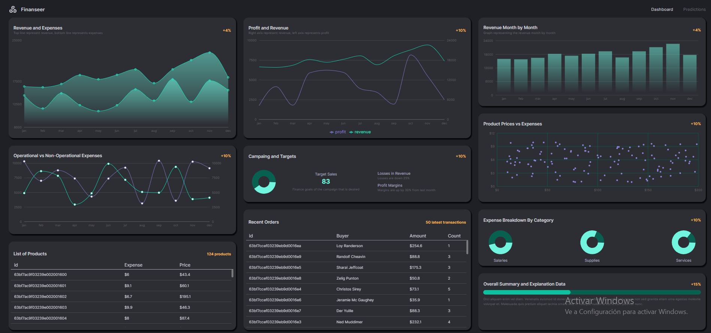

<h1 align="center" id="Title">
<a href="https://financedashboardnc.netlify.app/" alt="Finance Dashboard">

Finance Dashboard
</a>
</h1>

<h2 id="Description">Project Description</h2>

In this repository, you will find 2 routes:

- The first is a dashboard panel with analytics, graphs, and tables.
- The second is a table with business predictions made using the regressionJS library.

<h2 id="Indice">Indice</h2>

- [Title](#Title)

- [Project Description](#Description)

- [Indice](#Indice)

- [Project status](#Status)

- [Project features](#Features)

- [Access to projects](#Acces)

- [Used technologies](#Technologies)

<h2 id="Status">Project Status</h2>

 ✅ FINISHED ✅

<h2 id="Status">Project Features</h2>

### Business Analytics Panel

The first route is a panel that displays various metrics, analytics, and tables that show information about a business. This panel provides a comprehensive overview of the business's performance and helps stakeholders make data-driven decisions.

### Linear Regression Graph and Prediction

The second route is a graph that shows a linear regression based on data from a specified year. The linear regression was generated using the regressionJS library, which utilizes AI. With this linear regression, the application makes a prediction for the next year based on the trend observed in the data. This feature enables business owners to forecast their performance and plan accordingly.

Overall, this project provides a comprehensive solution for businesses looking to analyze their data and make informed decisions.

<h2 id="Acces">Access to projects</h2>

-  [Open in browser](https://financedashboardnc.netlify.app/)

-  [GitHub Repository](https://github.com/NaimCBGhassan/Finance-Dashboard)

<h2 id="Technologies">Used technologies</h2>

### FrontEnd

<ul >
  <li>TypeScript</li>
  <li>React</li>
  <li>Redux Toolkit</li>
  <li>Redux Toolkit Query</li>
  <li>Recharts</li>
  <li>React Router Dom</li>
  <li>RegressionJS</li>
  <li>Material UI</li>
  <li>ViteJS</li>
</ul>

### BackEnd

<ul >
  <li>NodeJs</li>
  <li>ExpressJs</li>
  <li>MongoDB</li>
  <li>Mongoose</li>
  <li>Helmet</li>
  <li>Cors</li>
  <li>Dotenv</li>
  <li>Morgan</li>
  <li>BodyParser</li>
</ul>
